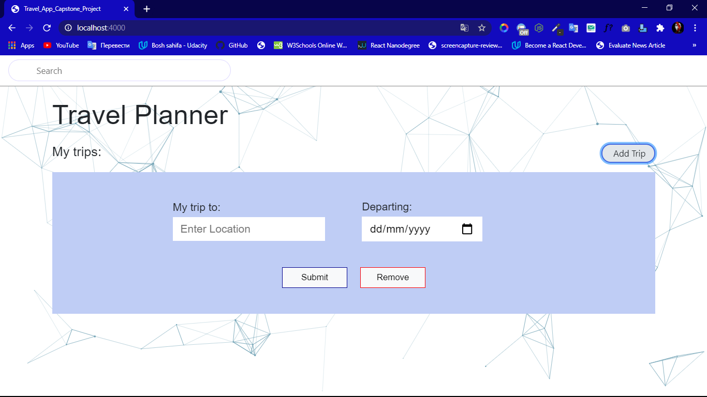
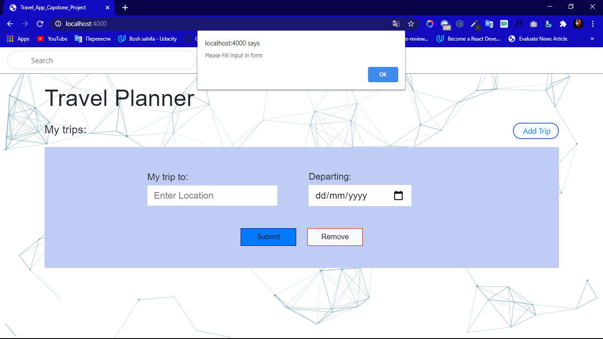
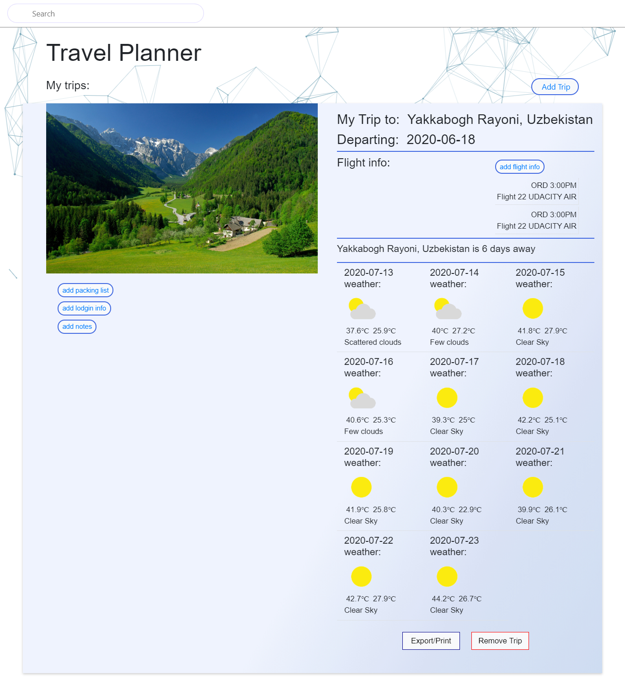

# Project Instructions

## Project Setup

`cd` into your new folder and run:
- `npm install`

- `npm run build-prod`

- `npm run start`

open your browser 

enter link `localhost:4000`

### Working Project, Enjoy

# Result project

# Home Page

## If you don't enter in input, alert massage

## Result 

